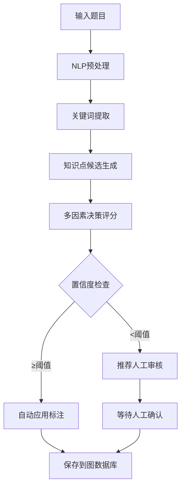

# AI Agent打标签和权重计算原理详解

## 📋 目录
- [整体架构](#整体架构)
- [标注决策流程](#标注决策流程)
- [权重计算算法](#权重计算算法)
- [关键词匹配机制](#关键词匹配机制)
- [多因素决策模型](#多因素决策模型)
- [实际应用示例](#实际应用示例)
- [参数调优指南](#参数调优指南)

## 整体架构

### 🏗️ AI Agent工作流程



### 🧠 核心组件

1. **NLP服务** (`nlp_service.py`) - 负责文本分析和初始推荐
2. **AI Agent服务** (`ai_agent_service.py`) - 负责智能决策和权重计算
3. **决策引擎** - 多因素综合评估算法
4. **权重调整器** - 动态权重计算和优化

## 标注决策流程

### 🔍 第一阶段：NLP分析

#### 1. 文本预处理
```python
def _preprocess_text(self, text: str) -> str:
    # 移除特殊字符，保留中英文和数字
    text = re.sub(r'[^\w\s\u4e00-\u9fff]', ' ', text)
    # 转换为小写
    text = text.lower()
    # 移除多余空格
    text = re.sub(r'\s+', ' ', text).strip()
    return text
```

#### 2. 关键词提取
```python
def _extract_keywords(self, text: str) -> List[str]:
    # 中文分词 (使用jieba)
    chinese_words = jieba.lcut(processed_text)
    
    # 英文单词提取
    english_words = re.findall(r'[a-zA-Z]+', processed_text)
    
    # 合并关键词并过滤
    keywords = [word for word in (chinese_words + english_words) if len(word) > 1]
    return keywords
```

#### 3. 关键词匹配评分
```python
def _keyword_matching_score(self, question_text: str, knowledge_point: str):
    patterns = self.keyword_patterns[knowledge_point]
    matched_keywords = []
    score = 0.0
    
    for pattern in patterns:
        if pattern.lower() in question_text.lower():
            matched_keywords.append(pattern)
            # 长关键词权重更高
            score += 2.0 if len(pattern) > 5 else 1.0
    
    # 归一化分数 (0-1之间)
    max_possible_score = len(patterns) * 2.0
    normalized_score = min(score / max_possible_score, 1.0)
    
    return normalized_score, matched_keywords
```

### 🎯 第二阶段：AI Agent决策

#### 多因素决策模型
```python
async def _calculate_decision_score(self, question, suggestion, base_confidence):
    score = base_confidence  # 基础置信度
    
    # 1. 题目类型匹配度加权 (+0.0~0.3)
    score += self._get_question_type_boost(question.question_type, suggestion.kp_name)
    
    # 2. 关键词匹配强度加权 (+0.0~0.2)
    score += self._get_keyword_match_boost(question.content, suggestion.keywords)
    
    # 3. 历史准确率加权 (+0.0~0.1)
    if self.learning_enabled:
        score += await self._get_historical_accuracy_boost(suggestion.kp_id, question.question_type)
    
    # 4. 题目难度匹配度 (+0.0~0.1)
    score += self._get_difficulty_match_boost(question.difficulty, suggestion.kp_name)
    
    # 5. 过度标注惩罚 (-0.0~0.3)
    score -= await self._get_over_annotation_penalty(question)
    
    return max(0.0, min(1.0, score))  # 限制在0-1之间
```

## 权重计算算法

### 🏆 权重计算的五个维度

#### 1. 题目类型匹配度 (Type Boost)
```python
def _get_question_type_boost(self, question_type: str, kp_name: str) -> float:
    type_mappings = {
        "选择题": {
            "语法": 0.2,    # 选择题很适合考查语法
            "时态": 0.2,    # 时态是选择题常考点
            "词汇": 0.1,    # 词汇选择题较常见
            "语态": 0.2     # 语态选择题很常见
        },
        "填空题": {
            "时态": 0.3,    # 填空题最适合考查时态
            "介词": 0.3,    # 介词填空很常见
            "词形变化": 0.2, # 词形变化适合填空
            "语法": 0.1
        },
        "阅读理解": {
            "阅读技巧": 0.3,
            "词汇理解": 0.2,
            "语法理解": 0.1
        },
        "翻译题": {
            "语法": 0.3,    # 翻译最考查语法
            "词汇": 0.2,
            "句型": 0.2
        }
    }
    
    # 如果题目类型和知识点匹配，返回对应权重
    if question_type in type_mappings:
        for keyword, boost in type_mappings[question_type].items():
            if keyword in kp_name:
                return boost
    return 0.0
```

**示例**:
- 题目: "She _____ to school every day." (选择题)
- 知识点: "动词时态"
- 匹配: "选择题" + "时态" → 加权 +0.2

#### 2. 关键词匹配强度 (Keyword Boost)
```python
def _get_keyword_match_boost(self, question_content: str, matched_keywords: List[str]) -> float:
    if not matched_keywords:
        return 0.0
    
    # 计算匹配密度
    total_matches = 0
    for keyword in matched_keywords:
        count = question_content.lower().count(keyword.lower())
        total_matches += count
    
    # 根据匹配密度给出加权
    content_length = len(question_content.split())
    match_density = total_matches / max(content_length, 1)
    
    return min(match_density * 0.3, 0.2)  # 最多加0.2分
```

**示例**:
- 题目: "Yesterday I went to the park"
- 匹配关键词: ["yesterday"]
- 匹配密度: 1/7 = 0.14
- 加权: 0.14 * 0.3 = 0.042

#### 3. 历史准确率加权 (History Boost)
```python
async def _get_historical_accuracy_boost(self, kp_id: str, question_type: str) -> float:
    # 查询该知识点在相同题目类型上的历史准确率
    # 如果历史准确率高，给予正向加权
    # 当前版本返回固定值，实际应用中基于用户反馈数据计算
    return 0.1
```

#### 4. 题目难度匹配度 (Difficulty Boost)
```python
def _get_difficulty_match_boost(self, question_difficulty: str, kp_name: str) -> float:
    difficulty_mappings = {
        "easy": ["基础", "简单", "入门"],
        "medium": ["中级", "一般", "标准"],
        "hard": ["高级", "复杂", "困难"]
    }
    
    if question_difficulty in difficulty_mappings:
        keywords = difficulty_mappings[question_difficulty]
        for keyword in keywords:
            if keyword in kp_name:
                return 0.1
    return 0.0
```

#### 5. 过度标注惩罚 (Over-annotation Penalty)
```python
async def _get_over_annotation_penalty(self, question: Question) -> float:
    # 如果题目已经有很多标注，降低新标注的分数
    existing_annotations = neo4j_service.find_knowledge_points_by_question(question.id)
    annotation_count = len(existing_annotations)
    
    if annotation_count >= 3:
        return 0.1 * (annotation_count - 2)  # 超过3个标注开始惩罚
    return 0.0
```

### 📊 权重计算公式

**最终决策分数** = 基础置信度 + 题目类型加权 + 关键词匹配加权 + 历史准确率加权 + 难度匹配加权 - 过度标注惩罚

```
Decision_Score = Base_Confidence 
               + Type_Boost (0~0.3)
               + Keyword_Boost (0~0.2) 
               + History_Boost (0~0.1)
               + Difficulty_Boost (0~0.1)
               - Over_Annotation_Penalty (0~0.3)
```

**权重调整规则**:
```python
# 最终权重 = min(决策分数, 1.0)
adjusted_weight = min(decision_score, 1.0)

# 自动应用条件
auto_applied = decision_score >= 0.7  # 高置信度自动应用
```

## 关键词匹配机制

### 📚 关键词库结构

```python
keyword_patterns = {
    "一般现在时": [
        # 时间标志词
        "always", "usually", "often", "sometimes", "never",
        "every day", "every week", "every month", "every year",
        
        # 中文标志词
        "总是", "通常", "经常", "有时", "从不", "每天", "每周",
        
        # 语法特征
        "第三人称单数", "动词原形", "does", "do", "goes", "plays"
    ],
    
    "现在完成时": [
        # 标志词
        "already", "yet", "just", "ever", "never", "since", "for",
        
        # 中文标志词  
        "已经", "还", "刚刚", "曾经", "从未", "自从", "持续",
        
        # 语法特征
        "have", "has", "过去分词", "finished", "done", "lived"
    ],
    
    "被动语态": [
        # 语法标志
        "be动词", "过去分词", "by", "被动", "passive voice",
        
        # 具体形式
        "was", "were", "is", "are", "am", "been",
        "cleaned", "written", "made", "done", "finished"
    ]
    
    # ... 更多知识点
}
```

### 🔍 匹配算法详解

#### 步骤1: 文本预处理
```python
# 原始题目
"She _____ to school every day. A) go B) goes C) going D) gone"

# 预处理后
"she to school every day a go b goes c going d gone"
```

#### 步骤2: 关键词扫描
```python
# 对每个知识点的关键词进行匹配
for knowledge_point in all_knowledge_points:
    patterns = keyword_patterns[knowledge_point]
    matched_keywords = []
    
    for pattern in patterns:
        if pattern.lower() in question_text.lower():
            matched_keywords.append(pattern)
```

#### 步骤3: 评分计算
```python
# 示例：一般现在时匹配
patterns = ["always", "usually", "every day", "goes", ...]
question = "she goes to school every day"

matched = ["every day", "goes"]  # 匹配到2个关键词
score = 1.0 + 1.0 = 2.0          # 短词1分，长词2分
max_score = len(patterns) * 2.0   # 最大可能分数
normalized = 2.0 / max_score      # 归一化到0-1
```

## 多因素决策模型

### 🎯 决策因子详解

#### 因子1: 基础置信度 (Base Confidence)
- **来源**: NLP服务的关键词匹配分数
- **范围**: 0.0 - 1.0
- **计算**: 基于关键词匹配密度和语义相似度

```python
# 综合分数计算
total_score = (keyword_score * 0.5 + semantic_score * 0.3 + type_score * 0.2)
```

#### 因子2: 题目类型加权 (Type Boost)
- **目的**: 不同题目类型适合考查不同知识点
- **权重**: 0.0 - 0.3

**匹配逻辑**:
```python
# 选择题 + 语法类知识点 → 高权重
# 填空题 + 时态类知识点 → 高权重  
# 阅读理解 + 理解类知识点 → 高权重
```

#### 因子3: 关键词匹配强度 (Keyword Boost)
- **目的**: 奖励关键词匹配密度高的标注
- **权重**: 0.0 - 0.2

**计算公式**:
```python
match_density = total_keyword_matches / question_word_count
keyword_boost = min(match_density * 0.3, 0.2)
```

#### 因子4: 历史准确率加权 (History Boost)
- **目的**: 基于过往标注效果调整权重
- **权重**: 0.0 - 0.1
- **状态**: 当前为固定值，未来可基于用户反馈优化

#### 因子5: 难度匹配度 (Difficulty Boost)
- **目的**: 题目难度与知识点复杂度应该匹配
- **权重**: 0.0 - 0.1

```python
# 简单题目 + 基础知识点 → 正向加权
# 困难题目 + 高级知识点 → 正向加权
```

#### 因子6: 过度标注惩罚 (Over-annotation Penalty)
- **目的**: 避免给单个题目标注过多知识点
- **权重**: 0.0 - 0.3 (负值)

```python
if annotation_count >= 3:
    penalty = 0.1 * (annotation_count - 2)  # 超过3个开始惩罚
```

## 实际应用示例

### 📝 示例1: 一般现在时题目

**题目**: "She _____ to school every day. A) go B) goes C) going D) gone"

#### 🔍 NLP分析阶段
```python
# 1. 关键词提取
keywords = ["she", "to", "school", "every", "day", "go", "goes", "going", "gone"]

# 2. 知识点匹配
knowledge_point = "一般现在时"
patterns = ["always", "usually", "every day", "goes", "第三人称单数"]

# 3. 匹配结果
matched_keywords = ["every day", "goes"]
keyword_score = 2.0 / (len(patterns) * 2.0) = 0.2
```

#### 🎯 AI Agent决策阶段
```python
base_confidence = 0.2  # 来自NLP服务

# 各因子计算
type_boost = 0.2       # 选择题 + 时态 → 高匹配度
keyword_boost = 0.05   # 关键词匹配密度: 2/9 * 0.3 = 0.067 → min(0.067, 0.2) = 0.067
history_boost = 0.1    # 历史准确率加权
difficulty_boost = 0.1 # 简单题目 + 基础知识点
penalty = 0.0          # 无现有标注，无惩罚

# 最终决策分数
decision_score = 0.2 + 0.2 + 0.05 + 0.1 + 0.1 - 0.0 = 0.65

# 权重调整
final_weight = min(0.65, 1.0) = 0.65
auto_applied = 0.65 >= 0.7 ? False  # 不自动应用，需人工审核
```

### 📝 示例2: 被动语态题目

**题目**: "The letter was written by Tom yesterday."

#### 🔍 NLP分析阶段
```python
# 关键词匹配
knowledge_point = "被动语态"
patterns = ["be动词", "过去分词", "by", "was", "were", "written"]
matched_keywords = ["was", "written", "by"]
keyword_score = 3.0 / (len(patterns) * 2.0) = 0.25
```

#### 🎯 AI Agent决策阶段
```python
base_confidence = 0.25

# 各因子计算
type_boost = 0.2       # 选择题 + 语态
keyword_boost = 0.1    # 关键词匹配密度较高
history_boost = 0.1    
difficulty_boost = 0.0 # 困难题目，无基础匹配加权
penalty = 0.0

# 最终决策分数
decision_score = 0.25 + 0.2 + 0.1 + 0.1 + 0.0 - 0.0 = 0.65

final_weight = 0.65
auto_applied = False   # 需人工审核
```

### 📝 示例3: 高置信度自动应用

**题目**: "Look! The children are playing in the playground."

#### 🔍 分析过程
```python
knowledge_point = "现在进行时"
matched_keywords = ["look", "are", "playing"]  # 强匹配
base_confidence = 0.4

# 决策计算
type_boost = 0.2      # 选择题适合考查时态
keyword_boost = 0.15  # 多个关键词匹配
history_boost = 0.1
difficulty_boost = 0.1
penalty = 0.0

decision_score = 0.4 + 0.2 + 0.15 + 0.1 + 0.1 = 0.85

final_weight = 0.85
auto_applied = True   # 0.85 >= 0.7，自动应用！
```

## 参数调优指南

### 🎛️ 关键参数说明

#### confidence_threshold (置信度阈值)
- **默认值**: 0.3
- **作用**: 只有决策分数超过此阈值的标注才会被推荐
- **调优策略**:
  - **提高阈值** (0.4-0.6): 更保守，准确率高但覆盖率低
  - **降低阈值** (0.1-0.2): 更激进，覆盖率高但可能误标

```python
# 保守策略 - 高准确率
ai_agent_service.update_configuration({
    "confidence_threshold": 0.5
})

# 激进策略 - 高覆盖率
ai_agent_service.update_configuration({
    "confidence_threshold": 0.15
})
```

#### max_auto_annotations (最大自动标注数)
- **默认值**: 5
- **作用**: 限制每道题目的最大标注数量
- **调优策略**:
  - **简单题目**: 设置为2-3个
  - **复杂题目**: 设置为3-5个

#### auto_apply_threshold (自动应用阈值)
- **默认值**: 0.7
- **作用**: 决策分数超过此值时自动应用标注
- **调优策略**:
  - **严格模式**: 0.8-0.9 (几乎不自动应用)
  - **平衡模式**: 0.6-0.7 (适度自动应用)
  - **激进模式**: 0.4-0.5 (大量自动应用)

### 🔧 权重因子调优

#### 调整各因子权重
```python
# 在_calculate_decision_score中调整权重
def _calculate_decision_score(self, question, suggestion, base_confidence):
    score = base_confidence
    
    # 可以调整这些系数来改变各因子的影响力
    score += self._get_question_type_boost(...) * 1.5      # 提高题目类型的重要性
    score += self._get_keyword_match_boost(...) * 2.0      # 提高关键词匹配的重要性
    score += self._get_historical_accuracy_boost(...) * 0.5 # 降低历史数据的影响
    
    return max(0.0, min(1.0, score))
```

#### 关键词权重调优
```python
# 在_keyword_matching_score中调整权重
for pattern in patterns:
    if pattern.lower() in question_lower:
        matched_keywords.append(pattern)
        
        # 可以根据关键词重要性给不同权重
        if pattern in ["already", "yesterday", "every day"]:  # 强标志词
            score += 3.0
        elif len(pattern) > 5:  # 长关键词
            score += 2.0  
        else:                   # 普通关键词
            score += 1.0
```

### 📊 性能监控和优化

#### 准确率监控
```python
def monitor_accuracy():
    # 定期计算准确率
    accuracy_data = analytics_service.get_ai_agent_accuracy_analysis()
    current_accuracy = accuracy_data['accuracy_analysis']['accuracy_rate']
    
    # 如果准确率下降，自动调整参数
    if current_accuracy < 60:
        # 提高置信度阈值
        ai_agent_service.update_configuration({
            "confidence_threshold": min(ai_agent_service.confidence_threshold + 0.1, 0.8)
        })
```

#### A/B测试框架
```python
class ABTestFramework:
    def __init__(self):
        self.test_groups = {
            "conservative": {"confidence_threshold": 0.5, "type_boost_factor": 1.0},
            "aggressive": {"confidence_threshold": 0.2, "type_boost_factor": 1.5},
            "balanced": {"confidence_threshold": 0.3, "type_boost_factor": 1.2}
        }
    
    def run_ab_test(self, questions: List[Question]):
        results = {}
        for group_name, config in self.test_groups.items():
            # 使用不同配置测试相同题目
            results[group_name] = self.test_with_config(questions, config)
        return results
```

### 🎯 实际调优建议

#### 1. 根据数据特点调优
```python
# 如果题目以选择题为主
type_mappings["选择题"] = {
    "语法": 0.3,  # 提高语法权重
    "时态": 0.3,  # 提高时态权重
    "词汇": 0.2
}

# 如果题目以填空题为主
type_mappings["填空题"] = {
    "时态": 0.4,  # 大幅提高时态权重
    "介词": 0.4,
    "词形变化": 0.3
}
```

#### 2. 基于准确率反馈调优
```python
def adaptive_tuning(accuracy_feedback):
    if accuracy_feedback < 70:
        # 准确率低，提高阈值
        self.confidence_threshold += 0.1
        
        # 增加关键词权重
        self.keyword_boost_factor = 1.5
    elif accuracy_feedback > 85:
        # 准确率高，可以降低阈值提高覆盖率
        self.confidence_threshold -= 0.05
```

#### 3. 动态权重学习
```python
def update_weights_from_feedback(user_feedback):
    """基于用户反馈动态调整权重"""
    for feedback in user_feedback:
        question_type = feedback['question_type']
        knowledge_point = feedback['knowledge_point']
        is_correct = feedback['is_correct']
        
        if is_correct:
            # 正确标注，增加对应的权重
            self._increase_type_weight(question_type, knowledge_point, 0.05)
        else:
            # 错误标注，减少对应的权重
            self._decrease_type_weight(question_type, knowledge_point, 0.05)
```

### 📈 性能优化技巧

#### 1. 缓存机制
```python
from functools import lru_cache

@lru_cache(maxsize=1000)
def _cached_keyword_matching(self, question_text: str, knowledge_point: str):
    """缓存关键词匹配结果"""
    return self._keyword_matching_score(question_text, knowledge_point)
```

#### 2. 批量优化
```python
def batch_decision_scoring(self, questions: List[Question], suggestions_batch: List[List[Dict]]):
    """批量计算决策分数，提高效率"""
    scores = []
    
    # 预计算共同的权重因子
    type_boost_cache = {}
    
    for question, suggestions in zip(questions, suggestions_batch):
        question_scores = []
        for suggestion in suggestions:
            # 使用缓存的权重因子
            score = self._fast_calculate_decision_score(question, suggestion, type_boost_cache)
            question_scores.append(score)
        scores.append(question_scores)
    
    return scores
```

#### 3. 并行处理
```python
import asyncio
from concurrent.futures import ThreadPoolExecutor

async def parallel_annotation(self, questions: List[Question]):
    """并行处理多个题目的标注"""
    with ThreadPoolExecutor(max_workers=4) as executor:
        loop = asyncio.get_event_loop()
        
        tasks = [
            loop.run_in_executor(executor, self.auto_annotate_question, question)
            for question in questions
        ]
        
        results = await asyncio.gather(*tasks)
    return results
```

---

## 🚀 总结

AI Agent的标注和权重计算是一个**多层次、多因素的智能决策系统**：

### 🧠 **核心思想**
1. **多维度评估**: 不依赖单一指标，综合多个因素判断
2. **动态权重**: 根据不同情况调整各因子的重要性
3. **自适应学习**: 可以根据用户反馈持续优化
4. **保守与激进平衡**: 通过阈值控制自动化程度

### 🎯 **权重计算本质**
- **基础分数**: 反映题目与知识点的基本相关性
- **加权因子**: 根据上下文和经验调整相关性
- **最终权重**: 综合所有因素的可信度评估

### 💡 **优化方向**
1. **扩充关键词库**: 提高基础匹配准确性
2. **调整因子权重**: 根据实际效果优化各维度重要性  
3. **引入机器学习**: 使用更先进的NLP模型
4. **用户反馈循环**: 建立持续学习机制

这个系统的设计理念是**"可解释的AI"** - 每个标注决策都有明确的理由和计算过程，便于理解、调试和优化！
