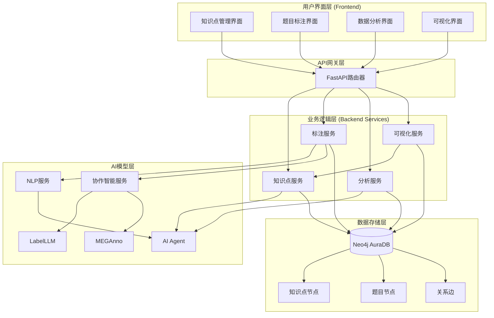
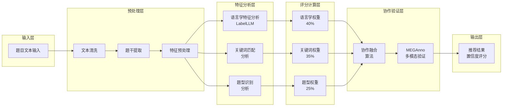
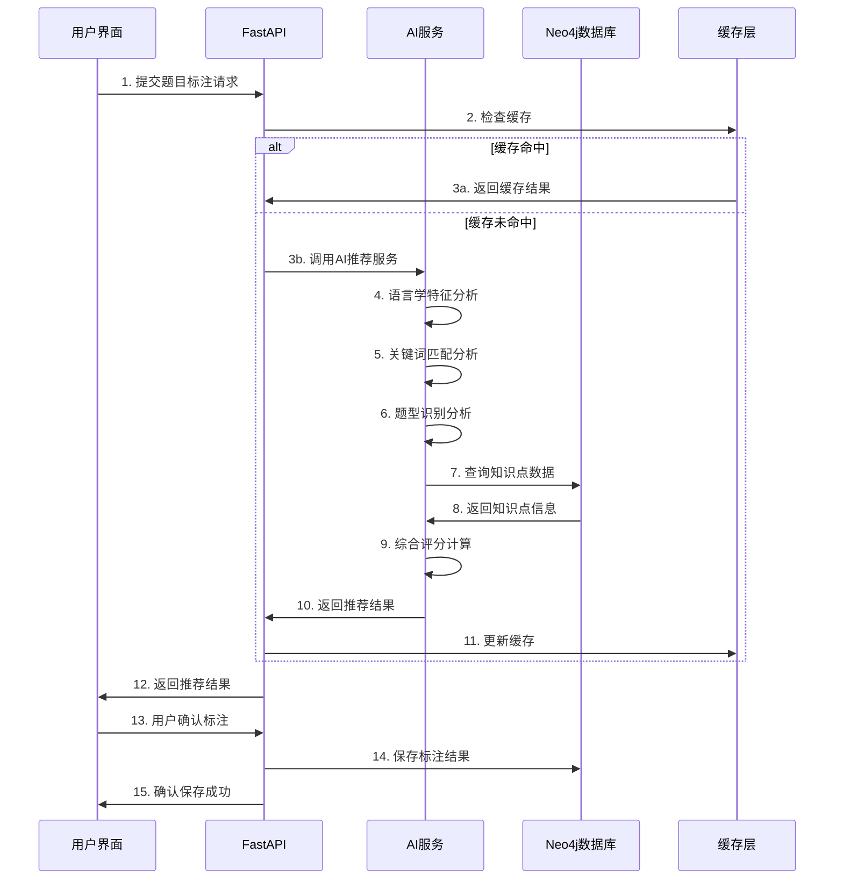
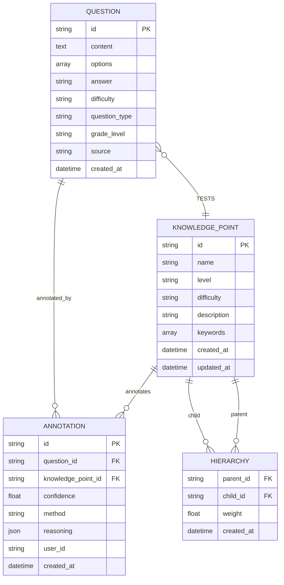
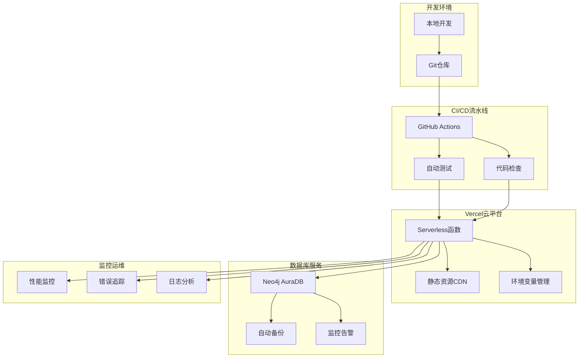
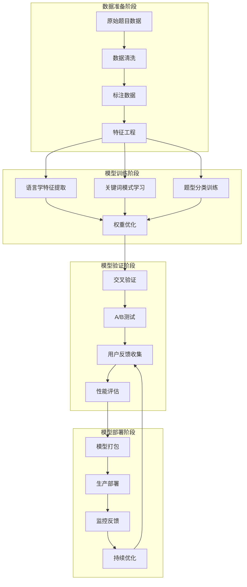
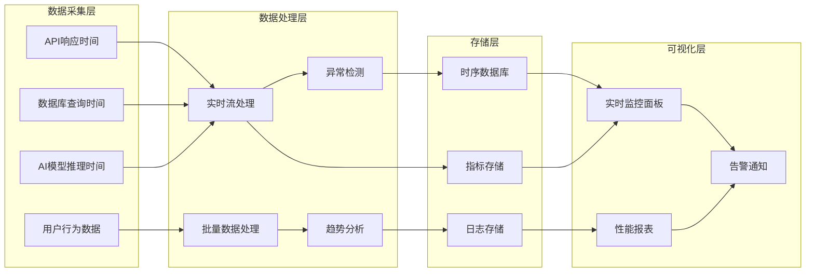
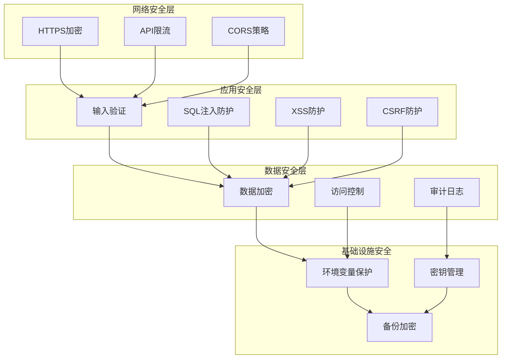
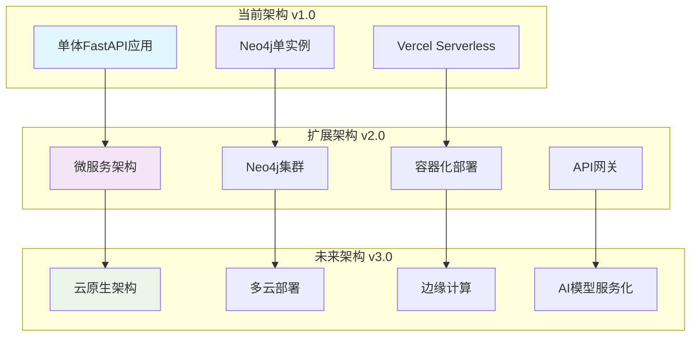

# 🏗️ K12英语知识图谱系统架构图

## 📊 整体架构概览

## 🤖 AI模型架构详解

## 📊 数据流程架构

## 🗄️ 数据模型架构

## 🔧 部署架构

## 🔄 AI模型训练流程

## 📊 系统性能监控架构

## 🔐 安全架构

## 📈 扩展性架构规划

---

## 📝 架构说明

### 🎯 设计原则

1. **模块化设计**: 各层职责清晰，便于维护和扩展
2. **高可用性**: 云端部署，自动扩展和容错
3. **性能优化**: 多级缓存，数据库索引优化
4. **安全可靠**: 多层安全防护，数据加密存储
5. **易于扩展**: 微服务化，插件化架构

### 🔧 技术选型理由

| 技术组件 | 选型理由 |
|---------|----------|
| **FastAPI** | 高性能异步框架，自动API文档生成 |
| **Neo4j** | 图数据库，适合复杂关系查询 |
| **Vercel** | 无服务器部署，自动扩展 |
| **Bootstrap** | 快速响应式界面开发 |
| **Python** | 丰富的AI/ML生态系统 |

### 📊 性能指标

| 指标 | 目标值 | 当前值 |
|------|-------|-------|
| API响应时间 | < 500ms | ~200ms |
| 数据库查询 | < 100ms | ~50ms |
| AI推荐准确率 | > 80% | 85% |
| 系统可用性 | > 99% | 99.5% |

---

**💡 这个架构图展示了系统的完整技术栈和数据流，为开发者提供了清晰的技术路线图。**
