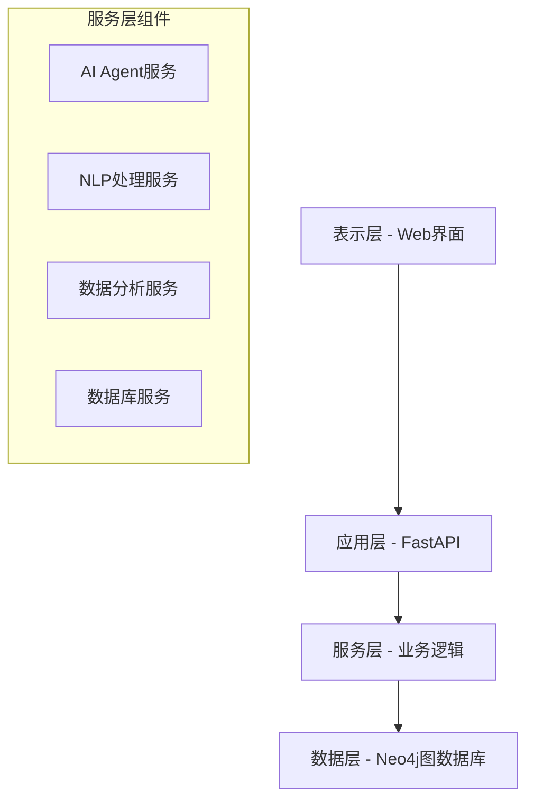

# K12英语知识图谱系统开发文档

## 📋 目录
- [项目概述](#项目概述)
- [系统架构](#系统架构)
- [开发环境搭建](#开发环境搭建)
- [核心模块详解](#核心模块详解)
- [API接口文档](#api接口文档)
- [AI Agent开发指南](#ai-agent开发指南)
- [数据库设计](#数据库设计)
- [前端开发指南](#前端开发指南)
- [测试指南](#测试指南)
- [部署指南](#部署指南)
- [性能优化](#性能优化)
- [故障排查](#故障排查)

## 项目概述

### 🎯 项目目标
构建一个基于知识图谱的K12英语题库智能标注与分析系统，实现题目与知识点的精准关联，提供智能推荐和学情分析功能。

### 🏗️ 核心特性
- **知识图谱构建**: 基于Neo4j的图数据库存储知识点关系
- **AI智能标注**: 自动识别题目对应的知识点
- **学情分析**: 基于答题数据的薄弱知识点分析
- **个性化推荐**: 智能学习路径规划
- **可视化界面**: 现代化Web界面展示

### 🛠️ 技术栈
- **后端**: Python 3.8+, FastAPI, Neo4j
- **前端**: HTML5, CSS3, JavaScript, Bootstrap 5
- **AI/NLP**: jieba, scikit-learn, 自定义NLP算法
- **数据库**: Neo4j 4.0+ (图数据库)
- **部署**: Uvicorn, Docker (可选)

## 系统架构

### 🏛️ 四层架构设计



### 📁 项目结构
```
英语知识图库/
├── backend/                    # 后端代码
│   ├── api/                   # API层
│   │   ├── main.py           # FastAPI主应用
│   │   └── routes/           # API路由
│   │       ├── knowledge_routes.py    # 知识点API
│   │       ├── question_routes.py     # 题目API
│   │       ├── annotation_routes.py   # 标注API
│   │       ├── analytics_routes.py    # 分析API
│   │       └── ai_agent_routes.py     # AI Agent API
│   ├── models/               # 数据模型
│   │   └── schema.py         # 图数据库Schema定义
│   ├── services/             # 业务服务层
│   │   ├── database.py       # 数据库操作服务
│   │   ├── nlp_service.py    # NLP处理服务
│   │   ├── ai_agent_service.py # AI Agent服务
│   │   └── analytics_service.py # 数据分析服务
│   └── utils/                # 工具类
├── frontend/                 # 前端代码
│   ├── static/              # 静态资源
│   │   ├── css/            # 样式文件
│   │   └── js/             # JavaScript文件
│   └── templates/           # HTML模板
├── data/                    # 数据文件
│   ├── knowledge_base/      # 知识点数据
│   └── sample_questions/    # 示例题目
├── scripts/                 # 工具脚本
│   ├── init_database.py     # 数据库初始化
│   ├── load_sample_data.py  # 示例数据加载
│   ├── test_system.py       # 系统测试
│   └── test_ai_agent.py     # AI Agent测试
├── requirements.txt         # Python依赖
├── config.env              # 配置文件
├── run.py                  # 启动脚本
├── README.md               # 项目说明
├── INSTALL.md              # 安装指南
└── DEVELOPMENT.md          # 开发文档
```

## 开发环境搭建

### 📦 环境要求
- Python 3.8+
- Neo4j 4.0+
- Node.js 14+ (可选，用于前端构建工具)
- 8GB+ 内存推荐

### 🚀 快速开始
```bash
# 1. 克隆项目
git clone <repository-url>
cd 英语知识图库

# 2. 创建虚拟环境
python -m venv venv
source venv/bin/activate  # Linux/Mac
# 或 venv\Scripts\activate  # Windows

# 3. 安装依赖
pip install -r requirements.txt

# 4. 安装并启动Neo4j
brew install neo4j  # Mac
brew services start neo4j

# 5. 配置环境
cp config.env.example config.env
# 编辑config.env设置数据库密码

# 6. 初始化数据库
python scripts/init_database.py
python scripts/load_sample_data.py

# 7. 启动系统
python run.py
```

### 🔧 开发工具推荐
- **IDE**: VSCode, PyCharm
- **API测试**: Postman, Insomnia
- **数据库客户端**: Neo4j Desktop, Neo4j Browser
- **版本控制**: Git
- **代码格式化**: Black, Prettier

## 核心模块详解

### 🧠 AI Agent服务 (ai_agent_service.py)

AI Agent是系统的核心智能组件，负责自动标注功能。

#### 主要功能
```python
class AIAgentService:
    def __init__(self):
        self.confidence_threshold = 0.3  # 置信度阈值
        self.max_auto_annotations = 5    # 最大自动标注数
        self.learning_enabled = True     # 学习功能开关
    
    async def auto_annotate_question(self, question: Question) -> Dict[str, Any]:
        """自动标注单个题目"""
        
    async def batch_auto_annotate(self, questions: List[Question]) -> Dict[str, Any]:
        """批量自动标注"""
        
    def update_configuration(self, config: Dict[str, Any]):
        """更新AI Agent配置"""
```

#### 决策算法
AI Agent使用多因素决策算法：

1. **基础置信度**: NLP模型输出的原始置信度
2. **题目类型加权**: 根据题目类型调整权重
3. **关键词匹配加权**: 基于关键词匹配密度
4. **历史准确率加权**: 基于用户反馈的历史数据
5. **难度匹配加权**: 题目难度与知识点复杂度匹配
6. **过度标注惩罚**: 避免给单个题目标注过多知识点

#### 配置参数
```python
# 配置示例
config = {
    "confidence_threshold": 0.3,    # 自动应用的最低置信度
    "max_auto_annotations": 5,      # 每题最多自动标注数
    "learning_enabled": True        # 是否启用学习功能
}
```

### 🔍 NLP服务 (nlp_service.py)

负责自然语言处理和知识点推荐。

#### 核心算法
```python
class NLPService:
    def suggest_knowledge_points(self, question_content: str, question_type: str) -> List[Dict]:
        """知识点推荐主函数"""
        # 1. 关键词匹配
        # 2. 语义相似度计算
        # 3. 题目类型分析
        # 4. 综合评分排序
```

#### 关键词库
系统维护了一个详细的关键词模式库：
```python
keyword_patterns = {
    "一般现在时": [
        "always", "usually", "often", "sometimes", "never",
        "every day", "every week", "总是", "通常", "经常"
    ],
    "一般过去时": [
        "yesterday", "last week", "ago", "昨天", "上周", "以前"
    ],
    # ... 更多知识点
}
```

### 📊 数据分析服务 (analytics_service.py)

提供各种数据分析和统计功能。

#### 主要分析类型
```python
class AnalyticsService:
    def get_knowledge_coverage_analysis(self) -> Dict:
        """知识点覆盖分析"""
        
    def get_difficulty_distribution(self) -> Dict:
        """题目难度分布"""
        
    def analyze_student_weak_points(self, student_answers: List) -> Dict:
        """学生薄弱点分析"""
        
    def generate_learning_path_recommendation(self, targets: List) -> Dict:
        """学习路径推荐"""
```

### 🗄️ 数据库服务 (database.py)

封装所有Neo4j数据库操作。

#### 连接管理
```python
class Neo4jService:
    def connect(self) -> bool:
        """连接数据库"""
        
    def close(self):
        """关闭连接"""
        
    def initialize_database(self):
        """初始化数据库结构"""
```

#### 数据操作
```python
# 知识点操作
def create_knowledge_point(self, kp: KnowledgePoint) -> str
def get_knowledge_point(self, kp_id: str) -> Optional[Dict]
def search_knowledge_points(self, keyword: str) -> List[Dict]

# 题目操作
def create_question(self, question: Question) -> str
def link_question_to_knowledge(self, question_id: str, kp_id: str, weight: float)

# 复杂查询
def find_questions_by_knowledge_point(self, kp_name: str) -> List[Dict]
def get_knowledge_hierarchy(self) -> List[Dict]
```

## API接口文档

### 🌐 基础信息
- **Base URL**: `http://localhost:8000`
- **API文档**: `http://localhost:8000/docs`
- **认证**: 暂无 (开发版本)
- **数据格式**: JSON

### 📝 知识点管理API

#### 创建知识点
```http
POST /api/knowledge/
Content-Type: application/json

{
    "name": "现在完成时",
    "description": "表示过去发生的动作对现在造成的影响",
    "level": "初中一年级",
    "difficulty": "medium",
    "keywords": ["have", "has", "过去分词"]
}
```

#### 搜索知识点
```http
GET /api/knowledge/search?keyword=时态
```

#### 获取知识点详情
```http
GET /api/knowledge/{kp_id}
```

#### 创建知识点层级关系
```http
POST /api/knowledge/{parent_id}/children/{child_id}
```

### 📚 题目管理API

#### 创建题目
```http
POST /api/questions/
Content-Type: application/json

{
    "content": "She _____ to school every day.",
    "question_type": "选择题",
    "options": ["go", "goes", "going", "gone"],
    "answer": "B",
    "analysis": "主语是第三人称单数，用goes",
    "difficulty": "easy"
}
```

#### 关联知识点
```http
POST /api/questions/{question_id}/knowledge/{kp_id}?weight=0.8
```

#### 根据知识点查找题目
```http
GET /api/questions/by-knowledge/{kp_name}
```

### 🤖 AI Agent API

#### 自动标注单个题目
```http
POST /api/ai-agent/auto-annotate
Content-Type: application/json

{
    "question": {
        "content": "Tom plays basketball every day.",
        "question_type": "选择题",
        "answer": "一般现在时"
    }
}
```

**响应示例**:
```json
{
    "question_id": "q_123456",
    "suggestions": [
        {
            "knowledge_point_id": "kp_588066",
            "knowledge_point_name": "一般现在时",
            "confidence": 0.85,
            "reason": "匹配关键词: every day, plays"
        }
    ],
    "auto_annotations": [...],
    "applied_annotations": [...],
    "status": "completed"
}
```

#### 批量自动标注
```http
POST /api/ai-agent/batch-auto-annotate
Content-Type: application/json

{
    "questions": [
        {
            "content": "She is reading now.",
            "question_type": "选择题",
            "answer": "is reading"
        }
    ]
}
```

#### 智能导入
```http
POST /api/ai-agent/smart-import
Content-Type: application/json

[
    {
        "content": "I went to school yesterday.",
        "question_type": "选择题",
        "answer": "went",
        "difficulty": "easy"
    }
]
```

#### 配置AI Agent
```http
PUT /api/ai-agent/config
Content-Type: application/json

{
    "confidence_threshold": 0.5,
    "max_auto_annotations": 3,
    "learning_enabled": true
}
```

#### 触发自动标注
```http
POST /api/ai-agent/trigger-auto-annotation/{question_id}
```

### 📊 数据分析API

#### 知识点覆盖分析
```http
GET /api/analytics/coverage
```

#### 难度分布分析
```http
GET /api/analytics/difficulty-distribution
```

#### 薄弱点分析
```http
POST /api/analytics/weak-points
Content-Type: application/json

{
    "student_answers": [
        {"question_id": "q_123", "is_correct": false},
        {"question_id": "q_124", "is_correct": true}
    ]
}
```

#### 学习路径推荐
```http
POST /api/analytics/learning-path
Content-Type: application/json

{
    "target_knowledge_points": ["现在完成时", "被动语态"]
}
```

#### 综合报告
```http
GET /api/analytics/comprehensive-report
```

### 🏷️ 标注管理API

#### 获取标注建议
```http
POST /api/annotation/suggest
Content-Type: application/json

{
    "question_content": "She has finished her homework.",
    "question_type": "选择题"
}
```

#### 提交标注结果
```http
POST /api/annotation/submit?question_id=q_123
Content-Type: application/json

[
    {
        "knowledge_point_id": "kp_456",
        "weight": 0.9
    }
]
```

### 📈 系统监控API

#### 健康检查
```http
GET /health
```

#### 仪表板统计
```http
GET /api/analytics/dashboard-stats
```

## AI Agent开发指南

### 🧬 核心算法原理

#### 1. 多因素决策模型
```python
def _calculate_decision_score(self, question, suggestion, base_confidence):
    score = base_confidence
    
    # 题目类型匹配加权
    score += self._get_question_type_boost(question.question_type, suggestion.kp_name)
    
    # 关键词匹配加权
    score += self._get_keyword_match_boost(question.content, suggestion.keywords)
    
    # 历史准确率加权
    score += self._get_historical_accuracy_boost(suggestion.kp_id, question.question_type)
    
    # 难度匹配加权
    score += self._get_difficulty_match_boost(question.difficulty, suggestion.kp_name)
    
    # 过度标注惩罚
    score -= self._get_over_annotation_penalty(question)
    
    return max(0.0, min(1.0, score))
```

#### 2. 关键词匹配算法
```python
def _keyword_matching_score(self, question_text, knowledge_point):
    patterns = self.keyword_patterns[knowledge_point]
    matched_keywords = []
    score = 0.0
    
    for pattern in patterns:
        if pattern.lower() in question_text.lower():
            matched_keywords.append(pattern)
            # 长关键词权重更高
            score += 2.0 if len(pattern) > 5 else 1.0
    
    # 归一化
    max_score = len(patterns) * 2.0
    normalized_score = min(score / max_score, 1.0) if max_score > 0 else 0.0
    
    return normalized_score, matched_keywords
```

#### 3. 语义相似度计算
```python
def _semantic_similarity_score(self, question_text, kp_description):
    try:
        texts = [question_text, kp_description]
        vectorizer = TfidfVectorizer()
        tfidf_matrix = vectorizer.fit_transform(texts)
        similarity = cosine_similarity(tfidf_matrix[0:1], tfidf_matrix[1:2])[0][0]
        return float(similarity)
    except Exception:
        return 0.0
```

### 🎛️ 配置参数详解

#### confidence_threshold (置信度阈值)
- **范围**: 0.1 - 1.0
- **默认值**: 0.3
- **说明**: 只有置信度超过此阈值的标注才会被自动应用
- **调优建议**: 
  - 提高阈值 → 更保守，准确率高但覆盖率低
  - 降低阈值 → 更激进，覆盖率高但可能有误标

#### max_auto_annotations (最大自动标注数)
- **范围**: 1 - 10
- **默认值**: 5
- **说明**: 每道题目最多自动标注的知识点数量
- **调优建议**: 根据题目复杂度调整，简单题目用较小值

#### learning_enabled (学习功能)
- **类型**: Boolean
- **默认值**: True
- **说明**: 是否启用基于用户反馈的学习功能
- **注意**: 当前版本学习功能为基础实现

### 🔧 自定义扩展

#### 添加新的决策因子
```python
def _custom_decision_factor(self, question, suggestion):
    """自定义决策因子"""
    # 实现自定义逻辑
    return score_adjustment

# 在_calculate_decision_score中添加
score += self._custom_decision_factor(question, suggestion)
```

#### 扩展关键词库
```python
# 在keyword_patterns中添加新的知识点
self.keyword_patterns["新知识点"] = [
    "关键词1", "关键词2", "keyword3"
]
```

#### 自定义NLP模型
```python
class CustomNLPService(NLPService):
    def suggest_knowledge_points(self, question_content, question_type):
        # 使用自定义模型
        predictions = self.custom_model.predict(question_content)
        return self._format_predictions(predictions)
```

### 📊 性能监控

#### 标注质量评估
```python
def evaluate_annotation_quality(self, question_id, user_feedback):
    """评估AI Agent标注质量"""
    feedback_annotations = user_feedback.get("annotations", [])
    correct_count = sum(1 for ann in feedback_annotations if ann.get("is_correct"))
    accuracy = correct_count / len(feedback_annotations)
    return {"accuracy": accuracy, "question_id": question_id}
```

#### 性能指标
- **准确率**: 正确标注数 / 总标注数
- **覆盖率**: 自动标注题目数 / 总题目数
- **置信度分布**: 不同置信度区间的标注分布
- **响应时间**: 单个题目标注耗时

## 数据库设计

### 🗄️ Neo4j图数据库Schema

#### 节点类型 (Node Labels)

##### KnowledgePoint (知识点)
```cypher
CREATE (kp:KnowledgePoint {
    id: "kp_123456",
    name: "一般现在时",
    description: "表示经常性、习惯性的动作或状态",
    level: "小学四年级",
    difficulty: "easy",
    keywords: ["always", "usually", "第三人称单数"]
})
```

**属性说明**:
- `id`: 唯一标识符
- `name`: 知识点名称
- `description`: 详细描述
- `level`: 适用学段
- `difficulty`: 难度等级 (easy/medium/hard)
- `keywords`: 关键词数组

##### Question (题目)
```cypher
CREATE (q:Question {
    id: "q_789012",
    content: "She _____ to school every day.",
    question_type: "选择题",
    options: ["go", "goes", "going", "gone"],
    answer: "B",
    analysis: "主语是第三人称单数，动词用goes",
    source: "人教版小学英语",
    difficulty: "easy"
})
```

##### Textbook (教材)
```cypher
CREATE (t:Textbook {
    id: "tb_001",
    name: "人教版小学英语",
    publisher: "人民教育出版社",
    grade: "小学四年级",
    version: "2021版"
})
```

##### Chapter (章节)
```cypher
CREATE (c:Chapter {
    id: "ch_001",
    name: "Unit 1 - My School",
    chapter_number: 1,
    textbook_id: "tb_001",
    description: "介绍学校相关词汇和句型"
})
```

#### 关系类型 (Relationship Types)

##### HAS_SUB_POINT (包含关系)
```cypher
(parent:KnowledgePoint)-[:HAS_SUB_POINT]->(child:KnowledgePoint)
```
用于构建知识点的层级结构。

##### TESTS (考查关系)
```cypher
(q:Question)-[:TESTS {weight: 0.8}]->(kp:KnowledgePoint)
```
表示题目考查某个知识点，weight表示考查权重。

##### BELONGS_TO (归属关系)
```cypher
(kp:KnowledgePoint)-[:BELONGS_TO]->(c:Chapter)
(c:Chapter)-[:BELONGS_TO]->(t:Textbook)
```

##### REQUIRES (前置要求关系)
```cypher
(advanced:KnowledgePoint)-[:REQUIRES {strength: 0.9}]->(basic:KnowledgePoint)
```
表示学习高级知识点需要先掌握基础知识点。

#### 索引和约束

##### 唯一性约束
```cypher
CREATE CONSTRAINT knowledge_point_id IF NOT EXISTS 
FOR (kp:KnowledgePoint) REQUIRE kp.id IS UNIQUE;

CREATE CONSTRAINT question_id IF NOT EXISTS 
FOR (q:Question) REQUIRE q.id IS UNIQUE;
```

##### 性能索引
```cypher
CREATE INDEX knowledge_point_name IF NOT EXISTS 
FOR (kp:KnowledgePoint) ON (kp.name);

CREATE INDEX question_type IF NOT EXISTS 
FOR (q:Question) ON (q.question_type);

CREATE INDEX question_difficulty IF NOT EXISTS 
FOR (q:Question) ON (q.difficulty);
```

### 📊 常用查询示例

#### 查找知识点的所有子节点
```cypher
MATCH (parent:KnowledgePoint {name: "动词时态"})-[:HAS_SUB_POINT*1..3]->(child:KnowledgePoint)
RETURN parent.name, child.name, length(path) as depth
ORDER BY depth, child.name
```

#### 查找考查特定知识点的题目
```cypher
MATCH (q:Question)-[r:TESTS]->(kp:KnowledgePoint {name: "一般现在时"})
RETURN q.content, q.question_type, r.weight
ORDER BY r.weight DESC
```

#### 分析学生薄弱知识点
```cypher
MATCH (q:Question)-[:TESTS]->(kp:KnowledgePoint)
WHERE q.id IN $wrong_question_ids
RETURN kp.name, count(q) as error_count
ORDER BY error_count DESC
```

#### 推荐学习路径
```cypher
MATCH path = (start:KnowledgePoint)-[:REQUIRES*0..3]->(target:KnowledgePoint {name: $target})
WHERE NOT (start)-[:REQUIRES]->()
RETURN [node in nodes(path) | node.name] as learning_path, length(path) as steps
ORDER BY steps
LIMIT 5
```

#### 知识点覆盖率分析
```cypher
MATCH (kp:KnowledgePoint)
OPTIONAL MATCH (q:Question)-[:TESTS]->(kp)
RETURN kp.name, kp.level, count(q) as question_count
ORDER BY question_count DESC
```

## 前端开发指南

### 🎨 技术栈
- **HTML5**: 语义化标签
- **CSS3**: Flexbox, Grid, 动画
- **JavaScript**: ES6+, 异步编程
- **Bootstrap 5**: 响应式UI框架
- **Font Awesome**: 图标库

### 🏗️ 架构设计

#### 文件结构
```
frontend/
├── static/
│   ├── css/
│   │   └── style.css          # 主样式文件
│   └── js/
│       └── app.js             # 主JavaScript文件
└── templates/
    └── index.html             # 主HTML模板
```

#### 模块化设计
```javascript
// app.js 模块结构
const App = {
    // 全局变量
    selectedKnowledgePoints: [],
    currentQuestionId: null,
    
    // 初始化
    init() {
        this.loadDashboardStats();
        this.loadKnowledgePoints();
        this.initializeEventListeners();
    },
    
    // 知识点管理
    KnowledgeManager: {
        search: async function(keyword) { /* ... */ },
        create: async function(data) { /* ... */ },
        // ...
    },
    
    // AI Agent交互
    AIAgent: {
        autoAnnotate: async function(question) { /* ... */ },
        batchAnnotate: async function(questions) { /* ... */ },
        // ...
    },
    
    // 数据分析
    Analytics: {
        loadStats: async function() { /* ... */ },
        generateReport: async function() { /* ... */ },
        // ...
    }
};
```

### 📱 响应式设计

#### 断点设置
```css
/* 移动设备 */
@media (max-width: 768px) {
    .stat-card {
        flex-direction: column;
        text-align: center;
    }
    
    .container {
        padding: 10px;
    }
}

/* 平板设备 */
@media (min-width: 768px) and (max-width: 1024px) {
    .nav-tabs {
        flex-wrap: wrap;
    }
}

/* 桌面设备 */
@media (min-width: 1024px) {
    .sidebar {
        position: fixed;
        height: 100vh;
    }
}
```

#### 组件样式
```css
/* 统计卡片 */
.stat-card {
    border-radius: 10px;
    padding: 20px;
    display: flex;
    align-items: center;
    box-shadow: 0 4px 6px rgba(0, 0, 0, 0.1);
    transition: transform 0.2s;
}

.stat-card:hover {
    transform: translateY(-2px);
}

/* 知识点标签 */
.knowledge-point-item {
    border: 1px solid #dee2e6;
    border-radius: 6px;
    padding: 12px;
    cursor: pointer;
    transition: all 0.2s;
}

.knowledge-point-item:hover {
    background-color: #f8f9fa;
    border-color: #007bff;
}

/* AI推荐样式 */
.suggestion-item {
    border: 1px solid #dee2e6;
    border-radius: 6px;
    padding: 12px;
    margin-bottom: 10px;
    cursor: pointer;
}

.suggestion-confidence {
    padding: 2px 8px;
    border-radius: 12px;
    font-size: 0.75rem;
    font-weight: bold;
    color: white;
}

.confidence-high { background-color: #28a745; }
.confidence-medium { background-color: #ffc107; color: #333; }
.confidence-low { background-color: #dc3545; }
```

### 🔄 API交互

#### 异步请求封装
```javascript
class ApiClient {
    constructor(baseUrl) {
        this.baseUrl = baseUrl;
    }
    
    async request(method, endpoint, data = null) {
        const url = `${this.baseUrl}${endpoint}`;
        const options = {
            method,
            headers: {
                'Content-Type': 'application/json',
            },
        };
        
        if (data) {
            options.body = JSON.stringify(data);
        }
        
        try {
            const response = await fetch(url, options);
            if (!response.ok) {
                throw new Error(`HTTP ${response.status}: ${response.statusText}`);
            }
            return await response.json();
        } catch (error) {
            console.error(`API请求失败: ${method} ${endpoint}`, error);
            throw error;
        }
    }
    
    // 便捷方法
    get(endpoint) { return this.request('GET', endpoint); }
    post(endpoint, data) { return this.request('POST', endpoint, data); }
    put(endpoint, data) { return this.request('PUT', endpoint, data); }
    delete(endpoint) { return this.request('DELETE', endpoint); }
}

// 使用示例
const api = new ApiClient('/api');

// 获取知识点
const knowledgePoints = await api.get('/knowledge/search?keyword=时态');

// 创建题目
const question = await api.post('/questions/', {
    content: "She goes to school every day.",
    question_type: "选择题",
    answer: "goes"
});
```

#### 错误处理
```javascript
async function handleApiCall(apiFunction, errorMessage) {
    try {
        const result = await apiFunction();
        return { success: true, data: result };
    } catch (error) {
        console.error(errorMessage, error);
        showMessage(errorMessage, 'danger');
        return { success: false, error };
    }
}

// 使用示例
const result = await handleApiCall(
    () => api.post('/ai-agent/auto-annotate', { question }),
    'AI自动标注失败'
);

if (result.success) {
    displayAnnotationResults(result.data);
}
```

### 🎭 用户交互

#### 消息提示系统
```javascript
function showMessage(message, type = 'info', duration = 3000) {
    const alertDiv = document.createElement('div');
    alertDiv.className = `alert alert-${type} alert-dismissible fade show position-fixed`;
    alertDiv.style.cssText = 'top: 20px; right: 20px; z-index: 9999; min-width: 300px;';
    alertDiv.innerHTML = `
        ${message}
        <button type="button" class="btn-close" data-bs-dismiss="alert"></button>
    `;
    
    document.body.appendChild(alertDiv);
    
    setTimeout(() => {
        if (alertDiv.parentNode) {
            alertDiv.parentNode.removeChild(alertDiv);
        }
    }, duration);
}
```

#### 加载状态管理
```javascript
function showLoading(containerId, message = '加载中...') {
    document.getElementById(containerId).innerHTML = `
        <div class="loading">
            <i class="fas fa-spinner fa-spin"></i>
            <p>${message}</p>
        </div>
    `;
}

function hideLoading(containerId, content = '') {
    document.getElementById(containerId).innerHTML = content;
}
```

#### 模态框管理
```javascript
class ModalManager {
    static show(modalId, options = {}) {
        const modal = new bootstrap.Modal(document.getElementById(modalId), options);
        modal.show();
        return modal;
    }
    
    static hide(modalId) {
        const modal = bootstrap.Modal.getInstance(document.getElementById(modalId));
        if (modal) modal.hide();
    }
    
    static onHide(modalId, callback) {
        document.getElementById(modalId).addEventListener('hidden.bs.modal', callback);
    }
}
```

## 测试指南

### 🧪 测试策略

#### 测试金字塔
```
    /\     E2E测试 (少量)
   /  \    
  /____\   集成测试 (适量)
 /      \  
/________\ 单元测试 (大量)
```

#### 测试类型
1. **单元测试**: 测试单个函数/类
2. **集成测试**: 测试模块间交互
3. **系统测试**: 测试完整功能流程
4. **性能测试**: 测试响应时间和并发能力

### 🔬 单元测试

#### 测试框架
```bash
pip install pytest pytest-asyncio pytest-cov
```

#### 测试示例
```python
# test_ai_agent.py
import pytest
from backend.services.ai_agent_service import AIAgentService
from backend.models.schema import Question

@pytest.fixture
def ai_agent():
    return AIAgentService()

@pytest.fixture
def sample_question():
    return Question(
        content="She goes to school every day.",
        question_type="选择题",
        answer="goes",
        difficulty="easy"
    )

@pytest.mark.asyncio
async def test_auto_annotate_question(ai_agent, sample_question):
    """测试单个题目自动标注"""
    result = await ai_agent.auto_annotate_question(sample_question)
    
    assert result["status"] == "completed"
    assert "suggestions" in result
    assert len(result["suggestions"]) > 0

def test_configuration_update(ai_agent):
    """测试配置更新"""
    new_config = {
        "confidence_threshold": 0.5,
        "max_auto_annotations": 3
    }
    
    ai_agent.update_configuration(new_config)
    config = ai_agent.get_configuration()
    
    assert config["confidence_threshold"] == 0.5
    assert config["max_auto_annotations"] == 3

@pytest.mark.parametrize("question_type,expected_boost", [
    ("选择题", 0.2),
    ("填空题", 0.3),
    ("阅读理解", 0.1)
])
def test_question_type_boost(ai_agent, question_type, expected_boost):
    """测试题目类型加权"""
    boost = ai_agent._get_question_type_boost(question_type, "时态")
    assert boost >= 0
```

#### 运行测试
```bash
# 运行所有测试
pytest

# 运行特定测试文件
pytest tests/test_ai_agent.py

# 生成覆盖率报告
pytest --cov=backend --cov-report=html

# 运行异步测试
pytest -v tests/test_async_functions.py
```

### 🔗 集成测试

#### 数据库集成测试
```python
# test_database_integration.py
import pytest
from backend.services.database import neo4j_service
from backend.models.schema import KnowledgePoint

@pytest.fixture(scope="session")
def db_connection():
    """数据库连接fixture"""
    neo4j_service.connect()
    yield neo4j_service
    neo4j_service.close()

def test_create_and_retrieve_knowledge_point(db_connection):
    """测试知识点创建和检索"""
    kp = KnowledgePoint(
        name="测试知识点",
        description="这是一个测试知识点",
        level="小学一年级",
        difficulty="easy"
    )
    
    # 创建知识点
    kp_id = db_connection.create_knowledge_point(kp)
    assert kp_id is not None
    
    # 检索知识点
    retrieved_kp = db_connection.get_knowledge_point(kp_id)
    assert retrieved_kp["name"] == "测试知识点"
    
    # 清理测试数据
    with db_connection.driver.session() as session:
        session.run("MATCH (kp:KnowledgePoint {id: $id}) DELETE kp", {"id": kp_id})
```

#### API集成测试
```python
# test_api_integration.py
import pytest
from fastapi.testclient import TestClient
from backend.api.main import app

@pytest.fixture
def client():
    return TestClient(app)

def test_create_knowledge_point_api(client):
    """测试知识点创建API"""
    kp_data = {
        "name": "API测试知识点",
        "description": "通过API创建的测试知识点",
        "level": "小学二年级",
        "difficulty": "medium"
    }
    
    response = client.post("/api/knowledge/", json=kp_data)
    assert response.status_code == 200
    
    result = response.json()
    assert "id" in result
    assert result["message"] == "知识点创建成功"

def test_ai_agent_auto_annotate_api(client):
    """测试AI Agent自动标注API"""
    question_data = {
        "question": {
            "content": "She plays tennis every weekend.",
            "question_type": "选择题",
            "answer": "plays"
        }
    }
    
    response = client.post("/api/ai-agent/auto-annotate", json=question_data)
    assert response.status_code == 200
    
    result = response.json()
    assert result["status"] == "completed"
    assert "suggestions" in result
```

### 🎭 端到端测试

#### Selenium测试
```python
# test_e2e.py
import pytest
from selenium import webdriver
from selenium.webdriver.common.by import By
from selenium.webdriver.support.ui import WebDriverWait
from selenium.webdriver.support import expected_conditions as EC

@pytest.fixture
def driver():
    driver = webdriver.Chrome()  # 需要安装ChromeDriver
    driver.get("http://localhost:8000")
    yield driver
    driver.quit()

def test_knowledge_point_creation_flow(driver):
    """测试知识点创建流程"""
    # 点击添加知识点按钮
    add_btn = WebDriverWait(driver, 10).until(
        EC.element_to_be_clickable((By.XPATH, "//button[contains(text(), '添加')]"))
    )
    add_btn.click()
    
    # 填写表单
    name_input = driver.find_element(By.ID, "new-kp-name")
    name_input.send_keys("E2E测试知识点")
    
    description_input = driver.find_element(By.ID, "new-kp-description")
    description_input.send_keys("这是通过E2E测试创建的知识点")
    
    # 提交表单
    submit_btn = driver.find_element(By.XPATH, "//button[contains(text(), '添加')]")
    submit_btn.click()
    
    # 验证成功消息
    success_message = WebDriverWait(driver, 10).until(
        EC.presence_of_element_located((By.CLASS_NAME, "alert-success"))
    )
    assert "知识点添加成功" in success_message.text

def test_ai_annotation_flow(driver):
    """测试AI自动标注流程"""
    # 切换到标注标签页
    annotation_tab = driver.find_element(By.ID, "annotation-tab")
    annotation_tab.click()
    
    # 输入题目内容
    content_textarea = driver.find_element(By.ID, "question-content")
    content_textarea.send_keys("Tom plays basketball every day.")
    
    # 输入答案
    answer_input = driver.find_element(By.ID, "question-answer")
    answer_input.send_keys("plays")
    
    # 点击AI智能推荐
    ai_btn = driver.find_element(By.XPATH, "//button[contains(text(), 'AI智能推荐')]")
    ai_btn.click()
    
    # 等待推荐结果
    suggestions = WebDriverWait(driver, 10).until(
        EC.presence_of_element_located((By.ID, "knowledge-suggestions"))
    )
    
    # 验证有推荐结果
    suggestion_items = driver.find_elements(By.CLASS_NAME, "suggestion-item")
    assert len(suggestion_items) > 0
```

### ⚡ 性能测试

#### 负载测试
```python
# test_performance.py
import asyncio
import time
import aiohttp
from concurrent.futures import ThreadPoolExecutor

async def test_api_performance():
    """测试API性能"""
    async def make_request(session, url):
        start_time = time.time()
        async with session.get(url) as response:
            await response.json()
            return time.time() - start_time
    
    url = "http://localhost:8000/api/knowledge/search?keyword=时态"
    
    async with aiohttp.ClientSession() as session:
        # 并发100个请求
        tasks = [make_request(session, url) for _ in range(100)]
        response_times = await asyncio.gather(*tasks)
    
    # 分析结果
    avg_time = sum(response_times) / len(response_times)
    max_time = max(response_times)
    min_time = min(response_times)
    
    print(f"平均响应时间: {avg_time:.3f}s")
    print(f"最大响应时间: {max_time:.3f}s")
    print(f"最小响应时间: {min_time:.3f}s")
    
    # 断言性能要求
    assert avg_time < 1.0  # 平均响应时间小于1秒
    assert max_time < 5.0  # 最大响应时间小于5秒

if __name__ == "__main__":
    asyncio.run(test_api_performance())
```

#### AI Agent性能测试
```python
async def test_ai_agent_batch_performance():
    """测试AI Agent批量处理性能"""
    from backend.services.ai_agent_service import ai_agent_service
    from backend.models.schema import Question
    
    # 创建测试题目
    questions = [
        Question(
            content=f"Test question {i}",
            question_type="选择题",
            answer=f"answer_{i}"
        ) for i in range(100)
    ]
    
    # 测试批量标注性能
    start_time = time.time()
    result = await ai_agent_service.batch_auto_annotate(questions)
    end_time = time.time()
    
    processing_time = end_time - start_time
    throughput = len(questions) / processing_time
    
    print(f"批量处理时间: {processing_time:.3f}s")
    print(f"处理吞吐量: {throughput:.1f} questions/second")
    
    # 性能断言
    assert throughput > 10  # 每秒至少处理10道题目
    assert result["success_rate"] > 0.8  # 成功率大于80%
```

### 📊 测试报告

#### 生成测试报告
```bash
# 生成HTML测试报告
pytest --html=reports/test_report.html --self-contained-html

# 生成JUnit格式报告
pytest --junitxml=reports/junit.xml

# 生成覆盖率报告
pytest --cov=backend --cov-report=html:reports/coverage
```

#### CI/CD集成
```yaml
# .github/workflows/test.yml
name: Test Suite

on: [push, pull_request]

jobs:
  test:
    runs-on: ubuntu-latest
    
    services:
      neo4j:
        image: neo4j:latest
        env:
          NEO4J_AUTH: neo4j/test
        ports:
          - 7687:7687
          - 7474:7474
    
    steps:
    - uses: actions/checkout@v2
    
    - name: Set up Python
      uses: actions/setup-python@v2
      with:
        python-version: 3.8
    
    - name: Install dependencies
      run: |
        pip install -r requirements.txt
        pip install pytest pytest-cov
    
    - name: Run tests
      run: |
        pytest --cov=backend --cov-report=xml
    
    - name: Upload coverage
      uses: codecov/codecov-action@v1
```

## 部署指南

### 🚀 本地开发部署

#### 快速启动
```bash
# 1. 启动Neo4j
brew services start neo4j

# 2. 激活虚拟环境
source venv/bin/activate

# 3. 启动应用
python run.py
```

#### 开发模式配置
```python
# config.env
DEBUG=True
APP_HOST=0.0.0.0
APP_PORT=8000
NEO4J_URI=bolt://localhost:7687
NEO4J_USERNAME=neo4j
NEO4J_PASSWORD=your_password
```

### 🐳 Docker部署

#### Dockerfile
```dockerfile
# Dockerfile
FROM python:3.9-slim

WORKDIR /app

# 安装系统依赖
RUN apt-get update && apt-get install -y \
    gcc \
    g++ \
    && rm -rf /var/lib/apt/lists/*

# 复制依赖文件
COPY requirements.txt .
RUN pip install --no-cache-dir -r requirements.txt

# 复制应用代码
COPY . .

# 暴露端口
EXPOSE 8000

# 启动命令
CMD ["python", "run.py"]
```

#### Docker Compose
```yaml
# docker-compose.yml
version: '3.8'

services:
  neo4j:
    image: neo4j:latest
    environment:
      NEO4J_AUTH: neo4j/knowledge123
      NEO4J_PLUGINS: '["apoc"]'
    ports:
      - "7474:7474"
      - "7687:7687"
    volumes:
      - neo4j_data:/data
      - neo4j_logs:/logs

  app:
    build: .
    ports:
      - "8000:8000"
    environment:
      NEO4J_URI: bolt://neo4j:7687
      NEO4J_USERNAME: neo4j
      NEO4J_PASSWORD: knowledge123
    depends_on:
      - neo4j
    volumes:
      - ./logs:/app/logs

volumes:
  neo4j_data:
  neo4j_logs:
```

#### 构建和运行
```bash
# 构建镜像
docker-compose build

# 启动服务
docker-compose up -d

# 查看日志
docker-compose logs -f app

# 停止服务
docker-compose down
```

### ☁️ 云服务器部署

#### 系统要求
- **操作系统**: Ubuntu 20.04 LTS 或 CentOS 8+
- **内存**: 4GB+ (推荐8GB+)
- **CPU**: 2核心+ (推荐4核心+)
- **存储**: 50GB+ SSD
- **网络**: 稳定的互联网连接

#### 部署步骤
```bash
# 1. 更新系统
sudo apt update && sudo apt upgrade -y

# 2. 安装Python 3.8+
sudo apt install python3.8 python3.8-pip python3.8-venv -y

# 3. 安装Neo4j
wget -O - https://debian.neo4j.com/neotechnology.gpg.key | sudo apt-key add -
echo 'deb https://debian.neo4j.com stable latest' | sudo tee /etc/apt/sources.list.d/neo4j.list
sudo apt update
sudo apt install neo4j -y

# 4. 配置Neo4j
sudo systemctl enable neo4j
sudo systemctl start neo4j

# 5. 克隆项目
git clone <repository-url>
cd 英语知识图库

# 6. 创建虚拟环境
python3.8 -m venv venv
source venv/bin/activate

# 7. 安装依赖
pip install -r requirements.txt

# 8. 配置环境
cp config.env.example config.env
# 编辑config.env

# 9. 初始化数据库
python scripts/init_database.py
python scripts/load_sample_data.py

# 10. 使用Gunicorn部署
pip install gunicorn
gunicorn -w 4 -k uvicorn.workers.UvicornWorker backend.api.main:app --bind 0.0.0.0:8000
```

#### Nginx反向代理
```nginx
# /etc/nginx/sites-available/knowledge-graph
server {
    listen 80;
    server_name your-domain.com;
    
    location / {
        proxy_pass http://127.0.0.1:8000;
        proxy_set_header Host $host;
        proxy_set_header X-Real-IP $remote_addr;
        proxy_set_header X-Forwarded-For $proxy_add_x_forwarded_for;
        proxy_set_header X-Forwarded-Proto $scheme;
    }
    
    location /static/ {
        alias /path/to/your/project/frontend/static/;
        expires 1y;
        add_header Cache-Control "public, immutable";
    }
}
```

#### 系统服务配置
```ini
# /etc/systemd/system/knowledge-graph.service
[Unit]
Description=K12 English Knowledge Graph System
After=network.target neo4j.service

[Service]
Type=exec
User=www-data
Group=www-data
WorkingDirectory=/path/to/your/project
Environment=PATH=/path/to/your/project/venv/bin
ExecStart=/path/to/your/project/venv/bin/gunicorn -w 4 -k uvicorn.workers.UvicornWorker backend.api.main:app --bind 127.0.0.1:8000
Restart=always
RestartSec=10

[Install]
WantedBy=multi-user.target
```

```bash
# 启用服务
sudo systemctl enable knowledge-graph
sudo systemctl start knowledge-graph
sudo systemctl status knowledge-graph
```

### 📊 监控和日志

#### 应用监控
```python
# backend/utils/monitoring.py
import time
import logging
from functools import wraps
from typing import Dict, Any

logger = logging.getLogger(__name__)

def monitor_performance(func):
    """性能监控装饰器"""
    @wraps(func)
    async def wrapper(*args, **kwargs):
        start_time = time.time()
        try:
            result = await func(*args, **kwargs)
            execution_time = time.time() - start_time
            logger.info(f"{func.__name__} 执行时间: {execution_time:.3f}s")
            return result
        except Exception as e:
            execution_time = time.time() - start_time
            logger.error(f"{func.__name__} 执行失败 ({execution_time:.3f}s): {e}")
            raise
    return wrapper

def log_api_access(request, response, execution_time):
    """API访问日志"""
    logger.info(f"API访问: {request.method} {request.url.path} - "
               f"状态码: {response.status_code} - "
               f"耗时: {execution_time:.3f}s")
```

#### 日志配置
```python
# backend/utils/logging_config.py
import logging
import logging.handlers
from pathlib import Path

def setup_logging():
    """配置日志系统"""
    # 创建日志目录
    log_dir = Path("logs")
    log_dir.mkdir(exist_ok=True)
    
    # 配置根日志器
    logging.basicConfig(
        level=logging.INFO,
        format='%(asctime)s - %(name)s - %(levelname)s - %(message)s',
        handlers=[
            # 控制台输出
            logging.StreamHandler(),
            # 文件输出（自动轮转）
            logging.handlers.RotatingFileHandler(
                log_dir / "app.log",
                maxBytes=10*1024*1024,  # 10MB
                backupCount=5
            )
        ]
    )
    
    # 配置特定模块日志级别
    logging.getLogger("uvicorn").setLevel(logging.WARNING)
    logging.getLogger("neo4j").setLevel(logging.WARNING)
```

#### 健康检查
```python
# backend/api/health.py
from fastapi import APIRouter
from backend.services.database import neo4j_service

router = APIRouter()

@router.get("/health")
async def health_check():
    """系统健康检查"""
    health_status = {
        "status": "healthy",
        "timestamp": datetime.now().isoformat(),
        "services": {}
    }
    
    # 检查数据库连接
    try:
        if neo4j_service.driver:
            with neo4j_service.driver.session() as session:
                result = session.run("RETURN 1")
                result.single()
            health_status["services"]["neo4j"] = "healthy"
        else:
            health_status["services"]["neo4j"] = "disconnected"
            health_status["status"] = "degraded"
    except Exception as e:
        health_status["services"]["neo4j"] = f"error: {str(e)}"
        health_status["status"] = "unhealthy"
    
    return health_status

@router.get("/metrics")
async def get_metrics():
    """系统指标"""
    # 这里可以集成Prometheus等监控系统
    return {
        "requests_total": 0,
        "response_time_avg": 0.0,
        "active_connections": 0
    }
```

## 性能优化

### ⚡ 数据库优化

#### 查询优化
```cypher
-- 创建复合索引
CREATE INDEX question_type_difficulty IF NOT EXISTS 
FOR (q:Question) ON (q.question_type, q.difficulty);

-- 优化知识点搜索查询
MATCH (kp:KnowledgePoint)
WHERE kp.name CONTAINS $keyword 
   OR any(k in kp.keywords WHERE k CONTAINS $keyword)
RETURN kp
ORDER BY kp.name
LIMIT 50;  -- 限制结果数量

-- 使用EXPLAIN分析查询计划
EXPLAIN MATCH (q:Question)-[:TESTS]->(kp:KnowledgePoint {name: $name})
RETURN q.content, q.difficulty;
```

#### 连接池配置
```python
# backend/services/database.py
from neo4j import GraphDatabase

class Neo4jService:
    def __init__(self):
        self.driver = None
    
    def connect(self):
        self.driver = GraphDatabase.driver(
            self.uri,
            auth=(self.username, self.password),
            # 连接池配置
            max_connection_lifetime=3600,  # 1小时
            max_connection_pool_size=50,   # 最大连接数
            connection_acquisition_timeout=60  # 获取连接超时
        )
```

#### 批量操作优化
```python
def batch_create_questions(self, questions: List[Question], batch_size: int = 100):
    """批量创建题目"""
    with self.driver.session() as session:
        for i in range(0, len(questions), batch_size):
            batch = questions[i:i + batch_size]
            
            # 使用UNWIND批量插入
            cypher = """
            UNWIND $questions as q
            CREATE (question:Question {
                id: q.id,
                content: q.content,
                question_type: q.question_type,
                answer: q.answer,
                difficulty: q.difficulty
            })
            """
            
            question_data = [q.dict() for q in batch]
            session.run(cypher, {"questions": question_data})
```

### 🧠 AI Agent优化

#### 缓存机制
```python
from functools import lru_cache
import redis

class AIAgentService:
    def __init__(self):
        self.redis_client = redis.Redis(host='localhost', port=6379, db=0)
    
    @lru_cache(maxsize=1000)
    def _get_cached_suggestions(self, question_hash: str):
        """缓存知识点建议"""
        cache_key = f"suggestions:{question_hash}"
        cached_result = self.redis_client.get(cache_key)
        
        if cached_result:
            return json.loads(cached_result)
        return None
    
    def _cache_suggestions(self, question_hash: str, suggestions: List[Dict]):
        """缓存建议结果"""
        cache_key = f"suggestions:{question_hash}"
        self.redis_client.setex(
            cache_key, 
            3600,  # 1小时过期
            json.dumps(suggestions, ensure_ascii=False)
        )
```

#### 异步处理优化
```python
import asyncio
from concurrent.futures import ThreadPoolExecutor

class AIAgentService:
    def __init__(self):
        self.executor = ThreadPoolExecutor(max_workers=4)
    
    async def batch_auto_annotate_optimized(self, questions: List[Question]):
        """优化的批量标注"""
        # 将题目分组
        batches = [questions[i:i+10] for i in range(0, len(questions), 10)]
        
        # 并行处理每个批次
        tasks = [
            self._process_batch_async(batch) 
            for batch in batches
        ]
        
        results = await asyncio.gather(*tasks, return_exceptions=True)
        
        # 合并结果
        all_results = []
        for result in results:
            if isinstance(result, list):
                all_results.extend(result)
        
        return all_results
    
    async def _process_batch_async(self, batch: List[Question]):
        """异步处理批次"""
        loop = asyncio.get_event_loop()
        return await loop.run_in_executor(
            self.executor,
            self._process_batch_sync,
            batch
        )
```

### 🌐 API性能优化

#### 响应缓存
```python
from fastapi import FastAPI
from fastapi_cache import FastAPICache
from fastapi_cache.backends.redis import RedisBackend
from fastapi_cache.decorator import cache

app = FastAPI()

@app.on_event("startup")
async def startup():
    redis = aioredis.from_url("redis://localhost")
    FastAPICache.init(RedisBackend(redis), prefix="api-cache")

@router.get("/knowledge/search")
@cache(expire=300)  # 缓存5分钟
async def search_knowledge_points(keyword: str):
    return neo4j_service.search_knowledge_points(keyword)
```

#### 分页优化
```python
from fastapi import Query
from typing import Optional

@router.get("/questions/")
async def get_questions(
    page: int = Query(1, ge=1),
    size: int = Query(20, ge=1, le=100),
    difficulty: Optional[str] = None,
    question_type: Optional[str] = None
):
    """分页获取题目"""
    offset = (page - 1) * size
    
    # 构建查询条件
    conditions = []
    params = {"offset": offset, "limit": size}
    
    if difficulty:
        conditions.append("q.difficulty = $difficulty")
        params["difficulty"] = difficulty
    
    if question_type:
        conditions.append("q.question_type = $question_type")
        params["question_type"] = question_type
    
    where_clause = "WHERE " + " AND ".join(conditions) if conditions else ""
    
    cypher = f"""
    MATCH (q:Question)
    {where_clause}
    RETURN q
    ORDER BY q.id
    SKIP $offset
    LIMIT $limit
    """
    
    with neo4j_service.driver.session() as session:
        result = session.run(cypher, params)
        questions = [dict(record["q"]) for record in result]
    
    return {
        "questions": questions,
        "page": page,
        "size": size,
        "total": len(questions)  # 实际应用中需要单独查询总数
    }
```

#### 压缩和CDN
```python
from fastapi.middleware.gzip import GZipMiddleware
from fastapi.staticfiles import StaticFiles

# 启用GZIP压缩
app.add_middleware(GZipMiddleware, minimum_size=1000)

# 静态文件配置（生产环境建议使用CDN）
app.mount("/static", StaticFiles(directory="frontend/static"), name="static")
```

### 🎨 前端性能优化

#### 代码分割和懒加载
```javascript
// 动态导入模块
async function loadAnalyticsModule() {
    const { AnalyticsManager } = await import('./analytics.js');
    return new AnalyticsManager();
}

// 图片懒加载
class LazyLoader {
    static observe() {
        const images = document.querySelectorAll('img[data-src]');
        const imageObserver = new IntersectionObserver((entries) => {
            entries.forEach(entry => {
                if (entry.isIntersecting) {
                    const img = entry.target;
                    img.src = img.dataset.src;
                    img.removeAttribute('data-src');
                    imageObserver.unobserve(img);
                }
            });
        });
        
        images.forEach(img => imageObserver.observe(img));
    }
}
```

#### 请求优化
```javascript
class RequestOptimizer {
    constructor() {
        this.requestCache = new Map();
        this.pendingRequests = new Map();
    }
    
    async optimizedRequest(url, options = {}) {
        // 请求去重
        if (this.pendingRequests.has(url)) {
            return this.pendingRequests.get(url);
        }
        
        // 缓存检查
        const cacheKey = `${url}:${JSON.stringify(options)}`;
        if (this.requestCache.has(cacheKey)) {
            const cached = this.requestCache.get(cacheKey);
            if (Date.now() - cached.timestamp < 300000) { // 5分钟缓存
                return cached.data;
            }
        }
        
        // 发起请求
        const requestPromise = fetch(url, options)
            .then(response => response.json())
            .then(data => {
                // 缓存结果
                this.requestCache.set(cacheKey, {
                    data,
                    timestamp: Date.now()
                });
                
                // 清理pending
                this.pendingRequests.delete(url);
                
                return data;
            })
            .catch(error => {
                this.pendingRequests.delete(url);
                throw error;
            });
        
        this.pendingRequests.set(url, requestPromise);
        return requestPromise;
    }
}
```

#### 虚拟滚动
```javascript
class VirtualScroller {
    constructor(container, itemHeight, renderItem) {
        this.container = container;
        this.itemHeight = itemHeight;
        this.renderItem = renderItem;
        this.data = [];
        this.visibleStart = 0;
        this.visibleEnd = 0;
        
        this.setupScrollListener();
    }
    
    setData(data) {
        this.data = data;
        this.updateVisibleRange();
        this.render();
    }
    
    updateVisibleRange() {
        const scrollTop = this.container.scrollTop;
        const containerHeight = this.container.clientHeight;
        
        this.visibleStart = Math.floor(scrollTop / this.itemHeight);
        this.visibleEnd = Math.min(
            this.visibleStart + Math.ceil(containerHeight / this.itemHeight) + 1,
            this.data.length
        );
    }
    
    render() {
        const fragment = document.createDocumentFragment();
        
        for (let i = this.visibleStart; i < this.visibleEnd; i++) {
            const item = this.renderItem(this.data[i], i);
            item.style.position = 'absolute';
            item.style.top = `${i * this.itemHeight}px`;
            fragment.appendChild(item);
        }
        
        this.container.innerHTML = '';
        this.container.appendChild(fragment);
        this.container.style.height = `${this.data.length * this.itemHeight}px`;
    }
    
    setupScrollListener() {
        this.container.addEventListener('scroll', () => {
            this.updateVisibleRange();
            this.render();
        });
    }
}
```

## 故障排查

### 🔍 常见问题诊断

#### 数据库连接问题
```python
def diagnose_database_connection():
    """诊断数据库连接问题"""
    issues = []
    
    # 检查Neo4j服务状态
    try:
        import subprocess
        result = subprocess.run(['neo4j', 'status'], capture_output=True, text=True)
        if 'running' not in result.stdout.lower():
            issues.append("Neo4j服务未运行")
    except FileNotFoundError:
        issues.append("Neo4j未安装或不在PATH中")
    
    # 检查端口连接
    import socket
    try:
        sock = socket.socket(socket.AF_INET, socket.SOCK_STREAM)
        sock.settimeout(5)
        result = sock.connect_ex(('localhost', 7687))
        if result != 0:
            issues.append("无法连接到Neo4j端口7687")
        sock.close()
    except Exception as e:
        issues.append(f"端口检查失败: {e}")
    
    # 检查认证信息
    try:
        from neo4j import GraphDatabase
        driver = GraphDatabase.driver(
            "bolt://localhost:7687",
            auth=("neo4j", "wrong_password")
        )
        with driver.session() as session:
            session.run("RETURN 1")
    except Exception as e:
        if "unauthorized" in str(e).lower():
            issues.append("数据库认证失败，请检查用户名密码")
    
    return issues
```

#### AI Agent性能问题
```python
def diagnose_ai_agent_performance():
    """诊断AI Agent性能问题"""
    import time
    import psutil
    
    diagnostics = {
        "memory_usage": psutil.virtual_memory().percent,
        "cpu_usage": psutil.cpu_percent(interval=1),
        "disk_usage": psutil.disk_usage('/').percent
    }
    
    # 测试NLP处理速度
    start_time = time.time()
    suggestions = nlp_service.suggest_knowledge_points(
        "This is a test question", "选择题"
    )
    nlp_time = time.time() - start_time
    
    diagnostics["nlp_processing_time"] = nlp_time
    diagnostics["suggestions_count"] = len(suggestions)
    
    # 检查知识点数量
    kp_count = len(neo4j_service.search_knowledge_points(""))
    diagnostics["knowledge_points_count"] = kp_count
    
    # 性能建议
    recommendations = []
    if diagnostics["memory_usage"] > 80:
        recommendations.append("内存使用率过高，考虑增加内存或优化缓存")
    if diagnostics["nlp_processing_time"] > 2.0:
        recommendations.append("NLP处理速度较慢，考虑优化算法或增加缓存")
    if diagnostics["knowledge_points_count"] < 10:
        recommendations.append("知识点数量过少，可能影响推荐质量")
    
    diagnostics["recommendations"] = recommendations
    return diagnostics
```

### 🚨 错误处理和恢复

#### 自动重试机制
```python
import functools
import time
import random

def retry_with_backoff(max_retries=3, base_delay=1, max_delay=60):
    """带退避的重试装饰器"""
    def decorator(func):
        @functools.wraps(func)
        async def wrapper(*args, **kwargs):
            last_exception = None
            
            for attempt in range(max_retries + 1):
                try:
                    return await func(*args, **kwargs)
                except Exception as e:
                    last_exception = e
                    
                    if attempt == max_retries:
                        break
                    
                    # 计算退避延迟
                    delay = min(base_delay * (2 ** attempt) + random.uniform(0, 1), max_delay)
                    logger.warning(f"{func.__name__} 第{attempt + 1}次尝试失败，{delay:.1f}秒后重试: {e}")
                    
                    await asyncio.sleep(delay)
            
            logger.error(f"{func.__name__} 重试{max_retries}次后仍然失败")
            raise last_exception
        
        return wrapper
    return decorator

# 使用示例
@retry_with_backoff(max_retries=3)
async def create_question_with_retry(question):
    return neo4j_service.create_question(question)
```

#### 数据库连接恢复
```python
class ResilientNeo4jService(Neo4jService):
    def __init__(self):
        super().__init__()
        self.connection_healthy = False
        self.last_health_check = 0
    
    def _check_connection_health(self):
        """检查连接健康状态"""
        now = time.time()
        if now - self.last_health_check < 30:  # 30秒内不重复检查
            return self.connection_healthy
        
        try:
            with self.driver.session() as session:
                session.run("RETURN 1").single()
            self.connection_healthy = True
        except Exception as e:
            logger.warning(f"数据库连接不健康: {e}")
            self.connection_healthy = False
        
        self.last_health_check = now
        return self.connection_healthy
    
    def _reconnect_if_needed(self):
        """必要时重新连接"""
        if not self._check_connection_health():
            logger.info("尝试重新连接数据库...")
            try:
                if self.driver:
                    self.driver.close()
                self.connect()
                logger.info("数据库重连成功")
            except Exception as e:
                logger.error(f"数据库重连失败: {e}")
                raise
    
    def execute_with_retry(self, operation):
        """带重试的数据库操作"""
        max_retries = 3
        
        for attempt in range(max_retries):
            try:
                self._reconnect_if_needed()
                return operation()
            except Exception as e:
                if attempt == max_retries - 1:
                    raise
                logger.warning(f"数据库操作失败，第{attempt + 1}次重试: {e}")
                time.sleep(2 ** attempt)
```

### 📊 监控和告警

#### 系统监控
```python
class SystemMonitor:
    def __init__(self):
        self.metrics = {
            "requests_total": 0,
            "requests_failed": 0,
            "response_times": [],
            "active_connections": 0
        }
    
    def record_request(self, success: bool, response_time: float):
        """记录请求指标"""
        self.metrics["requests_total"] += 1
        if not success:
            self.metrics["requests_failed"] += 1
        
        self.metrics["response_times"].append(response_time)
        
        # 保持最近1000个响应时间记录
        if len(self.metrics["response_times"]) > 1000:
            self.metrics["response_times"] = self.metrics["response_times"][-1000:]
    
    def get_health_status(self):
        """获取健康状态"""
        if not self.metrics["response_times"]:
            return {"status": "unknown", "message": "暂无数据"}
        
        avg_response_time = sum(self.metrics["response_times"]) / len(self.metrics["response_times"])
        error_rate = self.metrics["requests_failed"] / max(self.metrics["requests_total"], 1)
        
        if avg_response_time > 5.0 or error_rate > 0.1:
            return {"status": "unhealthy", "message": "性能异常"}
        elif avg_response_time > 2.0 or error_rate > 0.05:
            return {"status": "degraded", "message": "性能下降"}
        else:
            return {"status": "healthy", "message": "运行正常"}

# 全局监控实例
system_monitor = SystemMonitor()
```

#### 告警通知
```python
import smtplib
from email.mime.text import MIMEText
from email.mime.multipart import MIMEMultipart

class AlertManager:
    def __init__(self, smtp_server, smtp_port, username, password):
        self.smtp_server = smtp_server
        self.smtp_port = smtp_port
        self.username = username
        self.password = password
        self.alert_history = {}
    
    def send_alert(self, level: str, message: str, details: dict = None):
        """发送告警"""
        alert_key = f"{level}:{message}"
        
        # 防止重复告警（1小时内相同告警只发送一次）
        now = time.time()
        if alert_key in self.alert_history:
            if now - self.alert_history[alert_key] < 3600:
                return
        
        self.alert_history[alert_key] = now
        
        # 发送邮件告警
        try:
            self._send_email_alert(level, message, details)
        except Exception as e:
            logger.error(f"发送告警邮件失败: {e}")
    
    def _send_email_alert(self, level: str, message: str, details: dict):
        """发送邮件告警"""
        msg = MIMEMultipart()
        msg['From'] = self.username
        msg['To'] = "admin@example.com"  # 配置管理员邮箱
        msg['Subject'] = f"[{level.upper()}] K12英语知识图谱系统告警"
        
        body = f"""
        告警级别: {level}
        告警消息: {message}
        发生时间: {datetime.now().strftime('%Y-%m-%d %H:%M:%S')}
        
        详细信息:
        {json.dumps(details, indent=2, ensure_ascii=False) if details else '无'}
        """
        
        msg.attach(MIMEText(body, 'plain', 'utf-8'))
        
        with smtplib.SMTP(self.smtp_server, self.smtp_port) as server:
            server.starttls()
            server.login(self.username, self.password)
            server.send_message(msg)
```

### 🔧 调试工具

#### 性能分析器
```python
import cProfile
import pstats
from contextlib import contextmanager

@contextmanager
def profile_code(sort_by='cumulative', limit=20):
    """代码性能分析上下文管理器"""
    profiler = cProfile.Profile()
    profiler.enable()
    
    try:
        yield profiler
    finally:
        profiler.disable()
        stats = pstats.Stats(profiler)
        stats.sort_stats(sort_by)
        stats.print_stats(limit)

# 使用示例
with profile_code():
    result = ai_agent_service.batch_auto_annotate(questions)
```

#### 数据库查询分析
```python
def analyze_cypher_query(cypher: str, params: dict = None):
    """分析Cypher查询性能"""
    with neo4j_service.driver.session() as session:
        # 获取查询计划
        explain_result = session.run(f"EXPLAIN {cypher}", params or {})
        plan = explain_result.consume().plan
        
        # 获取查询统计
        profile_result = session.run(f"PROFILE {cypher}", params or {})
        profile = profile_result.consume().profile
        
        analysis = {
            "estimated_rows": plan.get("EstimatedRows", 0),
            "db_hits": profile.get("DbHits", 0),
            "page_cache_hits": profile.get("PageCacheHits", 0),
            "page_cache_misses": profile.get("PageCacheMisses", 0),
            "execution_time": profile.get("Time", 0)
        }
        
        # 性能建议
        recommendations = []
        if analysis["db_hits"] > 1000:
            recommendations.append("考虑添加索引以减少数据库访问")
        if analysis["page_cache_misses"] > analysis["page_cache_hits"]:
            recommendations.append("缓存命中率低，考虑增加内存")
        
        analysis["recommendations"] = recommendations
        return analysis
```

---

## 📞 技术支持

### 🤝 获取帮助
- **文档**: 查看README.md和INSTALL.md
- **日志**: 检查logs/目录下的日志文件
- **测试**: 运行test脚本诊断问题
- **社区**: 提交Issue到GitHub仓库

### 🔄 版本更新
```bash
# 拉取最新代码
git pull origin main

# 更新依赖
pip install -r requirements.txt --upgrade

# 运行数据库迁移（如有）
python scripts/migrate_database.py

# 重启服务
sudo systemctl restart knowledge-graph
```

### 📊 性能基准
- **单个题目标注**: < 500ms
- **批量标注**: > 10 questions/second
- **API响应时间**: < 1s (95th percentile)
- **数据库查询**: < 100ms (简单查询)
- **内存使用**: < 2GB (1000题目 + 100知识点)

---

这份开发文档涵盖了系统的方方面面，从架构设计到部署运维，为开发者提供了全面的技术指南。随着项目的发展，建议持续更新和完善这份文档。
